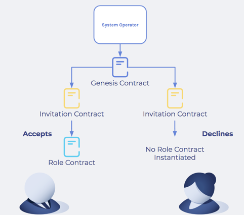
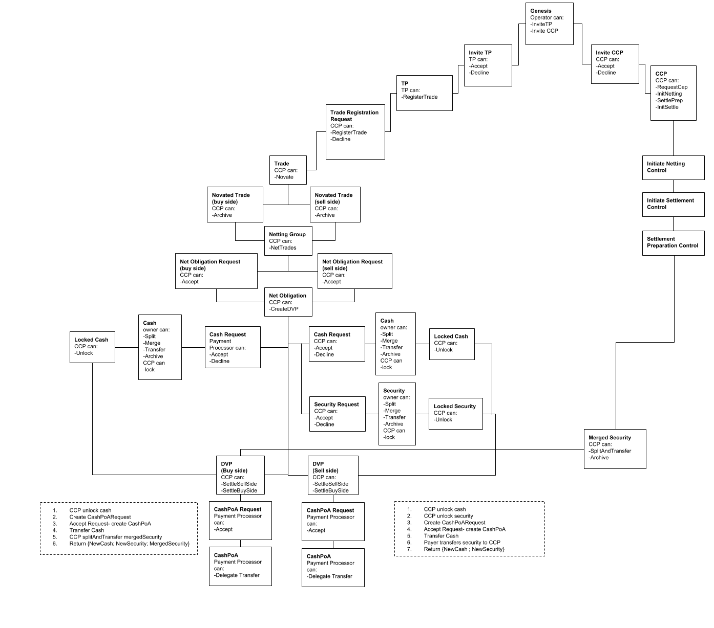

DAML Implementation
-------------------

Previous: `Repo Trading Model <repo-trading-model.rst>`_

This section goes through the implementation of the process in DAML.

Genesis Contract
~~~~~~~~~~~~~~~~

The `Genesis <../src/main/daml/Main/Genesis.daml#L17-L33>`_ contract is the first contract in the market. It’s the starting point for all workflows.

It defines the market operator and allows them to invite the CCP (Central Counter Party: the clearing house) and the Payment Processor.

Invitation Contract
~~~~~~~~~~~~~~~~~~~

The operator uses the `Genesis <../src/main/daml/Main/Genesis.daml#L1-L33>`_ contract to Invite CCP and Payment Processor to the market.

The `Genesis <../src/main/daml/Main/Genesis.daml#L17-L33>`_ and `Invitation <../src/main/daml/Main/CCP.daml#L38-L62>`_ contracts let the operator control the start of the contract workflow: no-one can enter the market without the operator’s permission.

If the invitee accepts a role in the market, a Role contract is created for them. If they decline, the Invitation contract is archived.

Once the CCP has been created, the trading participants can be invited.

Trading Participant Contract
~~~~~~~~~~~~~~~~~~~~~~~~~~~~

When a market participant accepts an `Trading Party Invitation <../src/main/daml/Main/TradingParticipant.daml#L17-L32>`_, a `TradingParticipant <../src/main/daml/Main/TradingParticipant.daml#L39-L73>`_ contract is created.

This contract formalizes their role by documenting their existence on the ledger. Its ``RequestTrade`` choice lets them propose a trade with another trading participant.

This choice creates a `TradeRegistrationRequest <../src/main/daml/Main/Trade.daml#L60-L81>`_, which lets the other participant accept the proposal or reject it. Acceptance results in `Trade <../src/main/daml/Main/Trade.daml#L28-L43>`_ contract being created. This is a binding agreement between the parties (``buyer`` and ``seller``) to trade defined securities and cash.

Creating Securities
~~~~~~~~~~~~~~~~~~~

A `Security <../src/main/daml/Main/Security.daml#L25-L64>`_ contract represents the securities being traded in the market. Securities are identified by ``CUSIP`` (an ID), and have an ``owner`` (the owning Party), ``parValue`` (the face value), and ``collateralQuantity`` (the quantity of securities). They also have the CCP as a signatory, since the CCP is the overall controller of the settlement process.

The owner of the contract can:

- **Split** the security: divide it into two assets, specifying the ``collateralQuantities`` of the two post-split security contracts.
- **Transfer** the security: give a new party ownership.

The CCP can:

- **Lock** the security.
  This creates a ``LockedSecurity`` contract, preventing the ``Security`` from being split or transferred until it is unlocked. See `Locking`_.
- **Archive** the security.
  This makes the contract inactive, so nobody (CCP or owner) can execute choices on the security.

Creating Cash
~~~~~~~~~~~~~

`Cash <../src/main/daml/Main/Cash.daml#L19-L56>`_ contracts represent the cash being traded in the market. ``Cash`` is identified by ``currency`` and ``amount``, and has an ``owner`` (the owning Party). The CCP is again a signatory, and Cash contracts can be merged, split, and transferred by the owner. They can be locked, and archived by the CCP.

Trade Contract
~~~~~~~~~~~~~~

`Trade <../src/main/daml/Main/Trade.daml#L9-L43>`_ contracts represent the trade agreement between two parties in the market. Trades are identified by ``buyer``, ``seller``, ``tradeInfo``, and ``CCP``.

Novation
~~~~~~~~

Each Trade has a `Novate <../src/main/daml/Main/Trade.daml#L37-L43>`_ choice. This splits the Trade up into two `NovatedTrade <../src/main/daml/Main/Trade.daml#L46-L57>`_ contracts: one between the CCP and the buyer, one between the CCP and the seller.

The CCP can archive this contract, removing it from the set of active contracts. It would do this after netting.

Grouping
~~~~~~~~

Grouping novated trades is an off-ledger process in which the CCP queries the ledger, and then creates groups of Trades with the same CUSIP, settlement date, participant ID, and currency.

The CCP then creates `NettingGroup <../src/main/daml/Main/Netting.daml#L42-L95>`_ contracts for each group, which have the ``NetTrades`` choice.

Netting and Net Obligations
~~~~~~~~~~~~~~~~~~~~~~~~~~~

The netting process combines the component trades of a ``Netting Group`` into one “net” outcome. Effectively, it sums up the receipts and subtracts the payments of cash, and the same for quantity of securities.

The result is a final amount that the party either collectively owes or is owed. A `Net Obligation <../src/main/daml/Main/NetObligation.daml#L63-L129>`_ contract represents this, and is composed of a:

Buyer or Seller
  If the netted quantity of securities is negative (meaning the party has agreed to sell more securities than it has agreed to buy), they are the seller and the CCP is the buyer. If the netted total is positive, vice versa: the party is the buyer. This is represented by the ``isBuy`` boolean flag on the NovateTrade template. (If isBuy is true, the non-CCP party is the buyer; if ``isBuy`` is false, they are the seller.)
Quantity
  The absolute value of the netted security.
paymentAmount
  The negative of the netted cash amount.

Asset Hydration
~~~~~~~~~~~~~~~

Once the ``NetObligation`` contracts are created, the trading parties must provide cash and assets for settlement. This is initiated by the CCP, who creates request contracts for both (`CashRequest <../src/main/daml/Main/CashRequest.daml#L16-L41>`_ and `SecurityRequest <../src/main/daml/Main/SecurityRequest.daml#L16-L34>`_). In response, the `PaymentProcessor <../src/main/daml/Main/PaymentProcessor.daml>`_ accepts the cash requests (on behalf of the trading participant), and the CCP accepts the security request. This creates the ``Cash`` and ``Asset`` Contracts requested, based on the amounts specified in the ``NetObligation``.

This process of instantiating cash and assets is called hydration, and must happen in order for the trades to be settled.

Hydration happens near the end of the workflow because having the assets and cash is not necessary for earlier steps, and the trade population is not large. In a real world situation, hydration may happen earlier, in batches, as trades are novated. This increases efficiency because it reduces the number of API calls required. It also allows time for the movement of actual cash and securities to settlement accounts. In this case, these accounts are not modelled, so it is possible to hydrate later in the workflow.

Both requests create a locked asset (`LockedCash <../src/main/daml/Main/Cash.daml#L78-L86>`_ and `LockedSecurity <../src/main/daml/Main/Security.daml#L86-L95>`_), locked by the CCP, which prevents the owners transferring them away until settlement is complete.

Locking
~~~~~~~

In any type of trade cleared by a third party, the cash and assets being exchanged must be locked until the settlement date: locking makes sure they cannot be used elsewhere. On the settlement date, the CCP unlocks and exchanges them.

This is important because, when the CCP takes ownership of the cash and assets, it assumes liability for them. If they are missing on the settlement date, the CCP cannot fulfill its legal obligation to provide them. Locking removes this risk.

Locking is implemented here by changing ``Security`` contracts to `LockedSecurity <../src/main/daml/Main/Security.daml#L86-L95>`_ and ``Cash`` to `LockedCash <../src/main/daml/Main/Cash.daml#L78-L86>`_.

Settlement
~~~~~~~~~~

Settlement is the process by which the CCP switches ownership of the assets and cash between the buyer and seller.

The netted DvPs represent the market participants’ final obligations. Since a DvP goes through several different states during settlement (not allocated, cash allocated, security allocated, fully allocated, settled), and since transition between each of these states requires creation of a new contract instance, it is convenient to represent each state with a specific template. These are;

* `DvP <../src/main/daml/Main/DvP.daml#L130-L160>`_ - a DvP with nothing allocated
* `CashAllocatedDvP <../src/main/daml/Main/DvP.daml#L84-L128>`_ - a DvP with ``Cash`` allocated and locked, but no securities
* `AllocatedDvP <../src/main/daml/Main/DvP.daml#L40-L82>`_ - a DvP with both ``Cash`` and ``Security`` allocated and locked, ready for settlement
* `SettledDvP <../src/main/daml/Main/DvP.daml#L20-L38>`_ - a settled DvP, representing that the transaction has been completed

Overview of the Workflow
------------------------

The below shows the flow of DAML contracts.

Next: `Automation description <automation-description.rst>`_.
